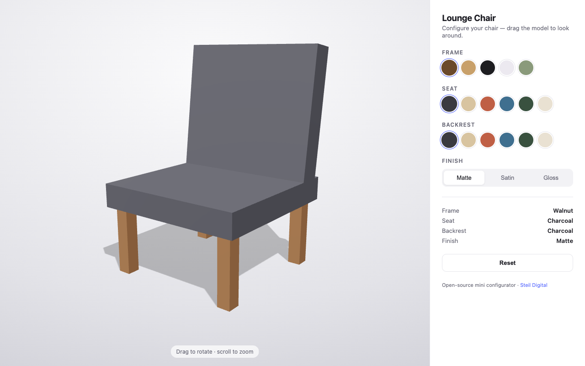

# Mini Configurator

A tiny, open-source **3D product configurator** built with [Three.js](https://threejs.org).
Rotate the product, pick colors per part, and switch the finish. The default product
is a lounge chair (frame / seat / backrest), built to be re-skinned.

The Three.js scene lives in one **framework-agnostic core**, so the same configurator
ships as a plain-HTML version and as React / Vue / Angular components that all drive
the same core.

**[▶ Live demo](https://stijntimmerman.github.io/mini-configurator/)** (vanilla version)



## Repository layout

| Folder | What |
|--------|------|
| `core/` | `configurator-core.js` — the Three.js scene + `createConfigurator()` API (`setColor`, `setFinish`, `reset`, `getState`, `onChange`, `dispose`). No DOM, no framework. |
| `vanilla/` | Plain HTML/CSS/JS version — no build step, Three.js via CDN import map. This is the live demo. |
| `react/`, `vue/`, `angular/` | The same configurator as a component in each framework, wrapping the shared core. *(being added)* |

## Run the vanilla version

ES modules must be served over HTTP (opening from `file://` is blocked by the
browser), so use any static server from the repo root:

```bash
python3 -m http.server 8000
# open http://localhost:8000/  (redirects to /vanilla/)
```

## Customize

Everything product-specific is in **`core/configurator-core.js`**:

- **`PALETTES`** — color options. `frame` uses one palette; `seat`/`back` share
  another. Each entry is `{ name, hex }`.
- **`FINISHES`** — roughness/metalness presets for matte / satin / gloss.
- **`createConfigurator()`** — builds the chair from primitives, each part using a
  shared material so recoloring updates every mesh. Replace the model section to
  configure a different product; keep the `frame` / `seat` / `back` part keys (or
  update them consistently in the UI).

Each front-end (vanilla and the framework versions) only builds the control panel
from `PALETTES` and calls the core API — so the 3D logic is never duplicated.

## Deploy

Static files (the vanilla version) host anywhere: GitHub Pages, Netlify, Vercel,
Cloudflare Pages, or any web server over HTTP/HTTPS. The framework versions build
to static files too.

## License

[MIT](./LICENSE).

---

Built by [Steil Digital](https://steildigital.nl).
